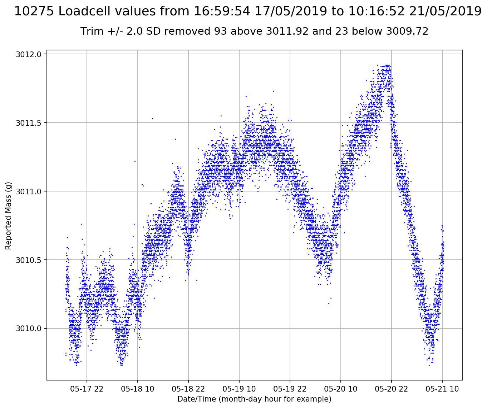

# piloadcell
Python code for plotting weight over time using a raspberry pi zero w, 10kg load cell and hx711 converter

Includes code to generate tab delimited averaged readings sampled every (e.g.) minute so we can evaluate drift and figure out
how to compensate for temperature. It should be used to tare before setting the weight on then left running - loadcell.py

Initial test suggested that the plots were horribly scaled by rare outliers - so the plots are now routinely limited
to +/- 2SD. Long runs can probably be plotted within 3SD. Some kind of autoregressive model us called for
because the mean clearly does vary in smoothish cycles - and the times don't suggest any obvious large temperature effects.
The unfiltered plot is served at route /raw by the flask server and usually shows that the outlier straightens out the previously
wiggly line by making the y axis longer so details are lost and the load cell looks less horrible.

Includes a flask server to plot current accumulated data from the flushed output file from the sampler process,
served at the server root. Also a stand alone plotter - loadcellplot.py can save a png of the current loadcell.xls file
or any suitable file pointed to by the first command line parameter - eg loadcellplot.py foo.xls

A continuous run on my basement floor with a fixed 3kg weight is shown below. Sure, it varies but the range is <3g in 3000 with
2SD trimming. We need much longer timespan but <0.1% over 3 days is far less bad than I had expected for a few dollars. For my
application this should be fine - 3g is 3ml of water and I'm weighing growing plants that get 1000g of water a day.

If zero is shown, the plot is a slightly wiggly straight line. The raw data look reasonable on the inevitably extended Y scale.

Temperature is a known external to check although it is not consistent. There's usually a rise starting around sunrise. Our
day time and night time temperature gradient is not huge - between 14-24 or so most autumn days here in Sydney...
I'll add a temperature probe because it may enable some of the drift to be modelled out.

**Background:**
I read up on them before I started this projects and it seems that unless you spend a lot of money, cheap
load cells have annoying habits making them hard to deploy reliably, particularly where regular taring is not possible
or where you want a long observation period without taring - which is what I'm looking for.

The beekeepers have dropped them from the [openhivescale project](https://github.com/openhivescale/mechanic) preferring a 
digitised but much more mechanical system based on an old foundary scale design. Clearly there are serious load cell problems.
Presumably the bee keeping community is full of smart people and they've been banging away at remote hive weight
sensing for a while.

Load cells suffer from drift and temperature changes, but cheap ones can be had for cheap - so little investment for fun.
As a data scientist, I want to know what the data look like...so I grabbed generic Chinese 10kg load cells and hx711 converter boards from eGay,
knowing I was probably in for a rough ride. Turns out they're probably not useless for my purposes.

**Requirements:**
Built for python3.5 on raspbian 9 (Debian Stretch). Developed on a pi zero w - best $20 I ever spent.

Requires https://github.com/tatobari/hx711py and the current raspbian versions of flask, pandas, numpy, matplotlib
dateutil and tzlocal installed - e.g. sudo apt install python3-pandas. Code may work under other versions of these
apps. Or not.

**Lessons so far:**

* Using a cheapo hx711, dropping the hx711 VCC+ from 5v to 3.3v resulted in huge gains in stability. Go figure. Both are within
the datasheet specs but maybe at a higher voltage some extra power is burned by regulation on the board so everything heats up?

* Using the hx711py read_average function with 10 samples seems to give reasonable estimates - trims the top and bottom values.

* Similarly, the code to manage readings allows the hx711 to sleep most of the time to minimise on board thermal effects. Seems also to
improve stability - assertion not empirically tested or measured.

* Getting matplotlib to plot a pandas UTC timestamp *as local time* on the x axis was a frustrating exercise - at least partly because
I'm using the raspbian versions of everything to make the project easier to test so they are not the latest and not always quite the
way the current documentation suggests. Whatever, finally figured it out....although it's probably much fuglier than needed.
