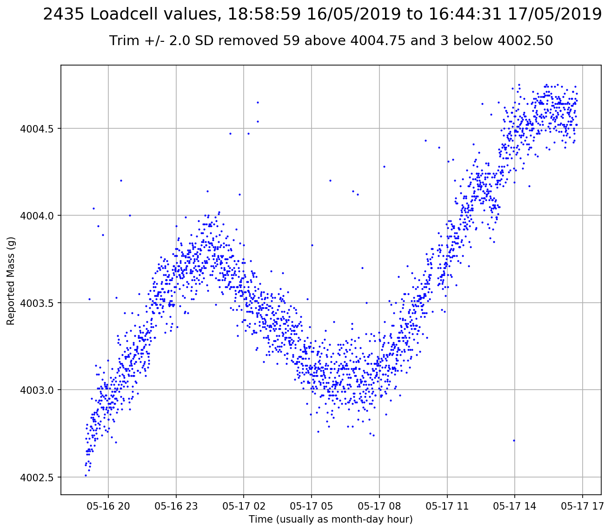

# piloadcell
Python code for plotting weight over time using a raspberry pi zero w, 10kg load cell and hx711 converter

Includes code to generate tab delimited averaged readings sampled every (e.g.) minute so we can evaluate drift and figure out
how to compensate for temperature.

Initial test suggested that the plots were horribly scaled by rare outliers - so the plots are now routinely limited
to +/- 2SD. Long runs can probably be plotted within 3SD. Some kind of autoregressive model us called for
because the mean clearly does vary in smoothish cycles - and the times don't suggest any obvious large temperature effects.
The unfiltered plot is served at route /raw by the flask server and usually shows that the outlier straightens out the previously
wiggly line by making the y axis longer so details are lost and the load cell looks less horrible.

Includes a flask server to plot current accumulated data from the flushed output file from the sampler process,
served at the server root.

An early continuous run on my study floor with a fixed 3kg weight added as soon as the loadcell
was tared to zero, is shown below. Need much longer timespan but it's looking far less bad than I had expected
for a few dollars. Even after a long initial climb, all values are within 2 gram in 4000. If zero is shown, the
plot is a slightly wiggly straight line. Temperature is a known external to check although it's not obvious knowing our
day time and night time temperature gradient is not huge - between 14-24 or so most autumn days here in Sydney...
I'll add that shortly because it may enable some of the drift to be modelled out.

**Background:**
In many ways, load cells have annoying habits making them hard to deploy reliably, particularly where regular taring is not possible.
The beekeepers have dropped them from the [openhivescale project](https://github.com/openhivescale/mechanic) preferring a 
digitised but much more mechanical system based on an old foundary scale design.

Load cells suffer from drift and temperature changes, but cheap ones can be had for cheap - so little investment for fun.
As a data scientist, I want to know what the data look like...so I grabbed some cheap 10kg load cells and hx711 converter boards from eGay,
knowing I was in for a rough ride. Turns out they're probably not useless for my purposes.

**Requirements:**
Built for python3.5 on raspbian 9 (Debian Stretch). Developed on a pi zero w - best $20 I ever spent.

Requires https://github.com/tatobari/hx711py and the current raspbian versions of flask, pandas, numpy, matplotlib
dateutil and tzlocal installed - e.g. sudo apt install python3-pandas. Code may work under other versions of these
apps. Or not.

**Lessons so far:**

* Using a cheapo hx711, dropping the hx711 VCC+ from 5v to 3.3v resulted in huge gains in stability. Go figure. Both are within
the datasheet specs but maybe the higher voltage burns more power on the board and heats everything up?

* Using the hx711py read_average function with 10 samples seems to give reasonable estimates - trims the top and bottom values.

* Similarly, the code to manage readings allows the hx711 to sleep most of the time to minimise on board thermal effects. Seems also to
improve stability - assertion not empirically tested or measured.

* Getting matplotlib to plot a pandas UTC timestamp *as local time* on the x axis was a frustrating exercise - at least partly because
I'm using the raspbian versions of everything to make the project easier to test so they are not the latest and not always quite the
way the current documentation suggests. Whatever, finally figured it out....although it's probably much fuglier than needed.
