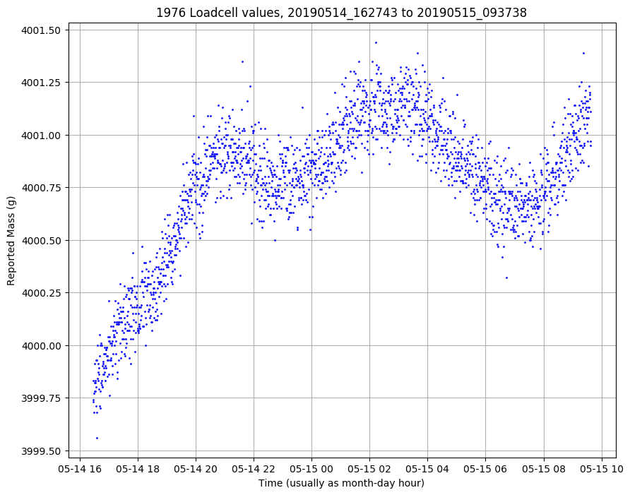

# piloadcell
Python code for raspberry pi, load cell and hx711 converter

Includes code to generate tab delimited averaged readings sampled every (e.g.) minute so we can evaluate drift and figure out
how to compensate for temperature. Also includes a flask server to get plots of current accumulated data from the output
of the sampler process. A 17 hour continuous run on my study floor after adding a fixed 4kg weight as soon as the loadcell
was tared to zero looks is shown below. Need much longer timespan but it's actually looking far less bad than I had expected
for a few dollars. Even after a long initial climb, all values are within 2 gram in 4000. Temperature is an obvious
external to check. I'll add that shortly because it may enable some of the drift to be modelled out. 

**Background:**
Load cells suck. The beekeepers have dropped them from the [openhivescale project](https://github.com/openhivescale/mechanic) preferring a 
digitised but much more mechanical system based on an old foundary scale design.

Load cells suffer from drift and temperature changes, but cheap ones can be had for cheap - so little investment for fun.
Being a data scientist means I want to know how badly they suck...so I grabbed some cheap 10kg load cells and hx711 converter boards from eGay,
knowing I was in for a rough ride. Turns out they're not that bad...

**Requirements:**
Built for python3.5 on raspbian 9 (Debian Stretch).

Requires https://github.com/tatobari/hx711py and the current raspbian versions of flask, pandas, numpy, matplotlib
dateutil and tzlocal installed - e.g. sudo apt install python3-pandas. Code may work under other versions of these
apps. Or not.

**Lessons so far:**

* Using a cheapo hx711, dropping the hx711 VCC+ from 5v to 3.3v resulted in huge gains in stability. Go figure. Both are within
the datasheet specs but maybe the higher voltage burns more power on the board and heats everything up?

* Using the hx711py read_average function with 10 samples seems to give reasonable estimates - trims the top and bottom values.

* Similarly, the code to manage readings allows the hx711 to sleep most of the time to minimise on board thermal effects. Seems also to
improve stability - assertion not empirically tested or measured.

* Getting matplotlib to plot a pandas UTC timestamp *as local time* on the x axis was a frustrating exercise - at least partly because
I'm using the raspbian versions of everything to make the project easier to test so they are not the latest and not always quite the
way the current documentation suggests. Whatever, finally figured it out....
